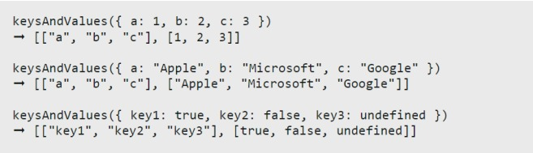

# Proyecto Uno
Crear una función que tome un objeto y devuelva las keys y values como matrices separadas. Devuelve las keys ordenadas alfabéticamente, y sus correspondientes values en el mismo orden.

## Imagen de Ejemplo

- **En JavaScript** 
